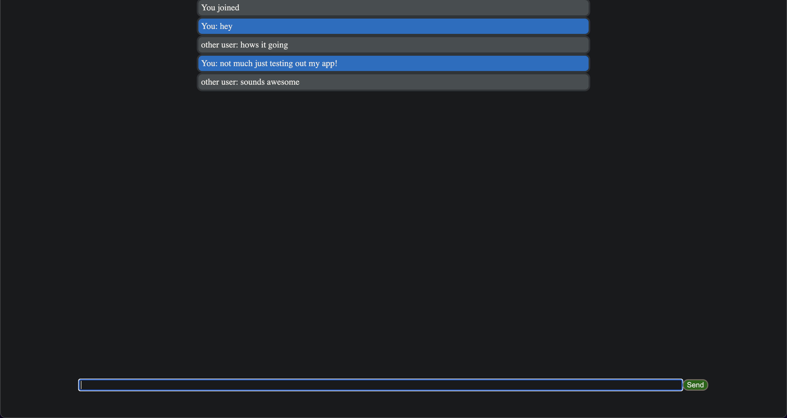

# Real-Time-Chat-App
- A chat app that utilizes socket.io and node.js in order to be real-time as well as have users
- Initiated an express server in order to deploy to Heroku so users can join in using one URL
- Try it out using the Heroku link provided!

